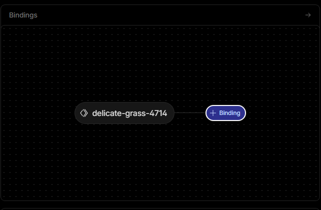
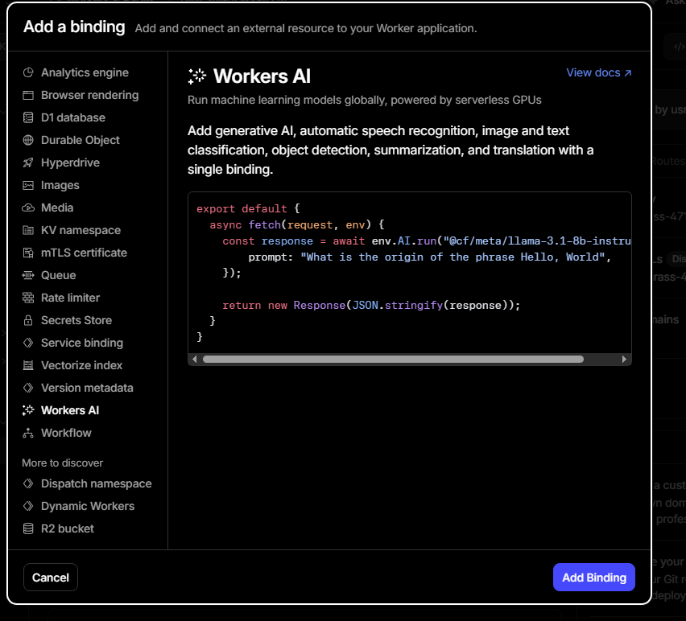
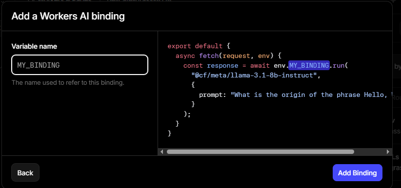

# ☁️ Cloudflare AI Worker — Free LLM API Proxy

> 🚫 **No need to pay for any AI API.**
> Use this template to get **100,000 free AI requests per day** powered by Cloudflare Workers AI — no credit card, no OpenAI bill, no server, no GPU needed.

[](https://deploy.workers.cloudflare.com/?url=https://github.com/dotusmanali/cloudflare-worker-template)

---

## 💡 Why Use This?

Cloudflare gives you **100,000 free AI inference requests every day** through their Workers AI platform.
This template wraps it into a simple API so you can use it with **Make.com, n8n, any app, or your own code** — just like OpenAI, but completely free.

---

## ✨ Features

| Feature | Details |
|---|---|
| 🆓 **100% Free** | Cloudflare Workers AI free tier — no credit card needed |
| 🔐 **Auth Protected** | Bearer token authentication with your own secret key |
| 🌐 **CORS Enabled** | Works from any frontend, Make.com, n8n, Postman |
| 🤖 **Multiple Models** | Switch between Llama, Mistral, Phi, Qwen and more |
| ⚡ **Streaming** | Supports both streaming and non-streaming responses |
| 📦 **OpenAI Format** | Compatible `messages` array format — drop-in replacement |

---

## 🤖 Supported Models (All Free)

```
@cf/meta/llama-3.3-70b-instruct-fp8-fast   ← Recommended (Best Quality)
@cf/meta/llama-3-8b-instruct
@cf/meta/llama-2-7b-chat-fp16
@cf/mistral/mistral-7b-instruct-v0.2
@cf/deepseek-ai/deepseek-r1-distill-qwen-32b
@cf/qwen/qwen1.5-0.5b-chat
@cf/microsoft/phi-2
```

> More models: [Cloudflare Workers AI Models Docs](https://developers.cloudflare.com/workers-ai/models/)

---

## 🚀 Step-by-Step Deployment Guide

### Step 1 — Open Cloudflare Dashboard

Go to [https://dash.cloudflare.com](https://dash.cloudflare.com) and log in (or create a free account).

In the left sidebar, find and click **"Workers & Pages"**.

---

### Step 2 — Create a New Worker

Click the **"Create application"** button (top right area).

You will see several options. Click **"Start with Hello World!"**.

You will see two fields:
- **Worker name** → Type any name you want (e.g. `my-ai-worker`)
- **Worker preview** → Ignore this

Click **"Deploy"**.

---

### Step 3 — Add Workers AI Binding

After deploying, you'll land on your worker's overview page. You'll see a box like this:



Click on **"Bindings"** inside that box.

---

### Step 4 — Select Workers AI

A panel will open on the left side with binding options.



Scroll down and click **"Worker AI"**.

---

### Step 5 — Set the Binding Name

After selecting Worker AI, a form appears:



In the **"Variable name"** field, type exactly:

```
AI
```

> ⚠️ **Important:** The name MUST be `AI` (capital letters). The code uses `env.AI` to call the models.

Click **"Add binding"** to save.

---

### Step 6 — Add Your Secret API Key

Now go to the **"Settings"** tab of your Worker.

Find **"Variables and Secrets"** (usually the 2nd or 3rd section).

Click **"Add"** or **"+ Add"** on the right side. A form will appear:

| Field | Value |
|---|---|
| **Type** | `Secret` |
| **Variable name** | `API_KEY` |
| **Value** | Your chosen secret password (e.g. `my-super-secret-key-123`) |

> ⚠️ **Important:** Variable name MUST be `API_KEY` (exact match). The code checks `env.API_KEY`.

> 🔐 **Tip:** Make your API key long and random — treat it like a password. Anyone with this key can use your worker.

Click **"Deploy"** to save the secret.

---

### Step 7 — Paste the Worker Code

Click **"Edit Code"** (top right button on the worker page).

In the code editor:
1. **Select all** existing code (`Ctrl+A`)
2. **Delete** it
3. **Paste** the contents of [`worker.js`](./worker.js) from this repository

Click **"Deploy"** (top right).

---

### Step 8 — Get Your Worker URL 🎉

Your worker URL will be shown at the top of the page. It looks like:

```
https://my-ai-worker.YOUR-SUBDOMAIN.workers.dev
```

**That's your free AI API endpoint!** You're done.

---

## 📡 How to Use the API

### Health Check (GET)

```bash
curl https://my-ai-worker.your-subdomain.workers.dev
```

Returns status + list of available models.

---

### Chat Completion (POST)

```bash
curl -X POST https://my-ai-worker.your-subdomain.workers.dev \
  -H "Authorization: Bearer YOUR_API_KEY" \
  -H "Content-Type: application/json" \
  -d '{
    "model": "@cf/meta/llama-3.3-70b-instruct-fp8-fast",
    "messages": [
      { "role": "system", "content": "You are a helpful assistant." },
      { "role": "user", "content": "What is 2+2?" }
    ],
    "max_tokens": 512,
    "stream": false
  }'
```

### Example Response

```json
{
  "id": "cf-1711234567890",
  "object": "chat.completion",
  "model": "@cf/meta/llama-3.3-70b-instruct-fp8-fast",
  "choices": [
    {
      "index": 0,
      "message": {
        "role": "assistant",
        "content": "2+2 equals 4."
      },
      "finish_reason": "stop"
    }
  ]
}
```

---

## 🔧 Use in Make.com / n8n

### Make.com (HTTP Module)

| Field | Value |
|---|---|
| **URL** | `https://my-ai-worker.your-subdomain.workers.dev` |
| **Method** | `POST` |
| **Headers** | `Authorization: Bearer YOUR_API_KEY` |
| **Body type** | `JSON` |
| **Body** | See example above |

### n8n (HTTP Request Node)

| Field | Value |
|---|---|
| **Method** | `POST` |
| **URL** | Your worker URL |
| **Authentication** | `Header Auth` → Key: `Authorization`, Value: `Bearer YOUR_API_KEY` |
| **Body** | `JSON` with messages array |

---

## 📁 Project Structure

```
cloudflare-worker-template/
├── worker.js          ← Main worker code (paste this into Cloudflare)
├── wrangler.toml      ← Wrangler CLI config (for developers)
├── README.md          ← This file
└── screenshots/        ← Dashboard screenshots for the guide
    ├── 1.png
    ├── 2.png
    └── 3.png
```

---

## 🛠️ Switch AI Model

In `worker.js`, line 27:

```js
const DEFAULT_MODEL = "@cf/meta/llama-3.3-70b-instruct-fp8-fast";
```

Change to any model from the supported list. Or pass `model` in the request body to switch per-request.

---

## 🔒 Security Notes

- Your `API_KEY` is stored as a **Secret** in Cloudflare — never exposed in code
- Always use `Bearer` token in `Authorization` header
- CORS is set to `*` — restrict it to your domain if needed

---

## 👨‍💻 Author

**Usman Ali** — [@dotusmanali](https://github.com/dotusmanali)

---

## ⭐ Like this project?

Give it a star on GitHub and share it with your friends! It helps a lot 🙏
